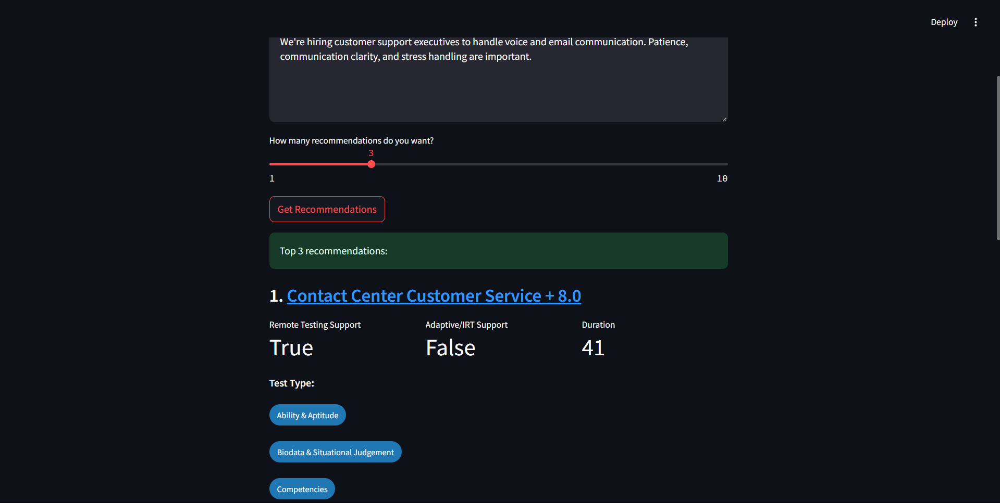
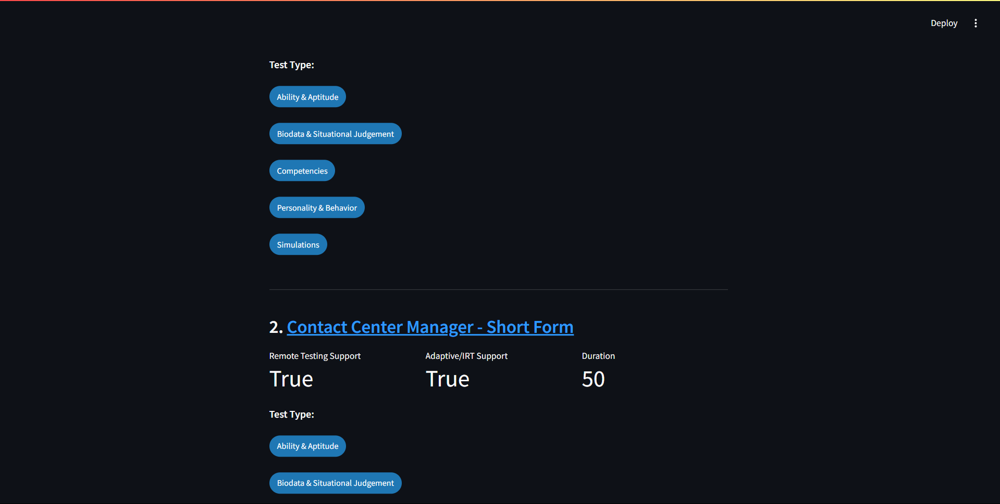

# SHL Assessment Recommendation Engine

A Smart Recommendation Engine that suggests SHL Assessments based on a user's job description or query. Designed as part of the **SHL Research Intern 2024** challenge (Option 2 - Smart Recommendation), this project uses Retrieval-Augmented Generation (RAG) powered by **Gemini API**, **FAISS**, **Flask API**, and **Streamlit** to offer intelligent, relevant recommendations.

---

## 🧠 Assessment Overview

The goal is to build a system that takes a job description (JD) or natural language query and recommends up to **10 SHL assessment solutions** from a catalog. The engine supports both a web UI (via Streamlit) and a backend **REST API (Flask)** to meet the submission requirement for an accessible programmatic interface.

---

## ✨ Features

- 🔍 Natural Language Input: Accepts plain text queries or job description URLs
- ⚙️ Simple Backend API: Accessible Flask REST endpoint for integration
- 🤖 RAG-based Recommendation: Uses Gemini API for embeddings and generation
- 🧠 Semantic Matching: FAISS-based vector similarity search
- 💻 Streamlit Frontend: Clean, fast, interactive web interface
- 📒 Jupyter Notebook: Recommendation logic and guided at each step (converted in .py file for easy access)
- 🧰 Minimal Dependencies: Easy to run locally or deploy to cloud


---

## 🛠️ Tech Stack

| Layer        | Tools & Libraries                                    |
|--------------|------------------------------------------------------|
| Backend      | Python, Flask, FAISS, Gemini API, Pandas             |
| Frontend     | Streamlit                                            |
| Notebook     | Jupyter (for pipeline dev)                           |
| NLP Models   | Gemini  (Text Generation)     |
| Storage      | FAISS Vector Index                                   |
| API Access   | Flask REST API                                       |

---

## 🗂️ Project Structure

```
📁 SHL-recommendation-engine/ 
├── assets/
│   ├── Screenshot 01.png
│   ├── Screenshot 02.png
│   ├── Screenshot 03.png
│   └── Screenshot 04.png
├── .env
├── .gitignore
├── api.py
├── app.py
├── product_embeddings.pkl
├── README.md
├── recommendation_engine.py
├── requirements.txt
└── webscrap2.py
```

---

## 🧪 Sample Inputs

| Input Type        | Example                                                                 |
|-------------------|-------------------------------------------------------------------------|
| Short Query       | "Best assessments for data analysts"                                    |

---


---

## 📊 Data Collection & Preprocessing

To build the SHL Assessment Recommendation Engine, we scraped data directly from SHL’s public website — specifically the **Pre-packaged Job Solutions** section, covering **up to 12 pages**.

###  Data Source:
- **URL**: https://www.shl.com/en/solutions/pre-packaged-solutions/

### 🛠️ Issues Found During Scraping:

1. ❌ **Missing Column Headers**:  
   The scraped CSV file did not contain any headers.

2. ❌ **Strings Enclosed in Double Quotes**:  
   Some values (like test names and types) were surrounded by double quotes, requiring cleaning.

3. ❓ **Unclear Test Type Codes**:  
   SHL uses internal codes like `CPAB`, `AKP`, etc., which were ambiguous and required decoding.

---

### ✅ Cleaning & Fixes:

- 🧾 **Manual Header Insertion**:  
  We added column headers manually using a CSV editor.

- 🧹 **Quote Removal**:  
  Applied Find & Replace to clean all extra double quotes (`"`).

- 🧠 **Test Type Code Mapping**:  
  We used the legend provided on SHL's website to map cryptic codes to their actual meanings.

  | Code | Meaning                              |
  |------|--------------------------------------|
  | A    | Ability & Aptitude                   |
  | B    | Biodata & Situational Judgement      |
  | C    | Competencies                         |
  | D    | Development & 360                    |
  | E    | Assessment Exercises                 |
  | K    | Knowledge & Skills                   |
  | P    | Personality & Behavior               |
  | S    | Simulations                          |

  For example:
  - `CPAB` → `Competencies, Personality & Behavior, Ability & Aptitude, Biodata & SJ`
  - `AKP` → `Ability & Aptitude, Knowledge & Skills, Personality & Behavior`

- ✅ Final Cleaned File:  
  The preprocessed and updated file is stored as:  
  **`updated_file.csv`**

---


## 🚀 How It Works

1. **User Input**:
   - From Streamlit UI or Flask API, the user submits a job description or query.
   
2. **Embedding Generation**:
   - The input is converted to a dense vector using **Gemini Embeddings**.

3. **Similarity Search**:
   - The vector is searched against a FAISS index built from SHL products.

4. **Top-K Retrieval**:
   - Retrieves the top 10 most relevant assessments.

5. **Response Generation**:
   - Gemini Pro summarizes results in a user-friendly way (RAG-style).

6. **Output**:
   - Recommendations are returned to the UI or via JSON API.

---

## 📡 Flask API Endpoint

To meet the submission requirement, A simple Flask REST API has been implemented. It allows external systems to retrieve recommendations programmatically.

### ▶️ Start the API Server

```bash
python flask_api.py
```

### 📥 Endpoint

```
POST /recommend
```

### 🧾 Request JSON

```json
{
  "query": "Looking for a software engineer with Python and ML experience."
}
```


> 🔐 Don't forget to set your `GEMINI_API_KEY` before launching the API server. and Make sure you added it as an environmental value

---

## 📦 Installation

1. **Clone the Repo**

```bash
git clone https://github.com/SaumyaSubham/SHL-recommendation-engine.git 
cd SHL-recommendation-engine
```

2. **Install Requirements**

```bash
pip install -r requirements.txt
```

3. **Set Gemini API Key**

use a `.env` file (with python-dotenv):

```
GEMINI_API_KEY=your-key-here
```

4. **Run Streamlit UI**

```bash
streamlit run app.py
```

5. **Run Flask API**

```bash
python flask_api.py
```

---

## 🎯 Future Enhancements

- Upload JD as PDF/Doc
- LLM-based explainability of recommendations
- User feedback loop
- Deployment on HuggingFace or Streamlit Cloud

---

## 🌐 Deployments

- Streamlit Cloud : https://shl-recommendation-engine01.streamlit.app/
- Render : 
---


## 📸 Screenshots

  
 
  


---

## 👨‍💻 Author

**Saumya Subham Mishra**  
Final Year CSE | Aspiring Data Scientist | Open Source Contributor  
📫 sm025663@gmail.com  
🌐 [LinkedIn](https://www.linkedin.com/in/saumya-subham-mishra/) • 🐙 [GitHub](https://github.com/SaumyaSubham/)

---

## 📄 License

MIT License